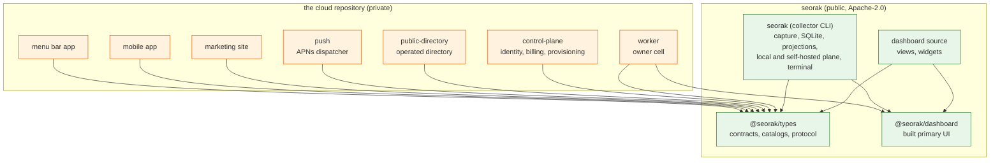
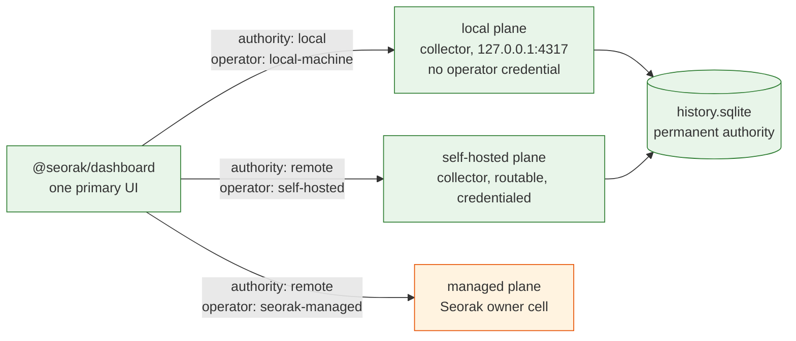

# ADR 005: Open-core repository topology, licensing, and Free UI packaging

> **This is a redacted form of ADR 005. It is not the whole document.**
>
> The original was written inside Seorak's private repository, and its evidence
> sections argue for the split by naming the things that stay private: module
> lists for the cloud services, provisioned infrastructure identifiers, operator
> setup steps, and internal handoff records. Publishing those would defeat the
> decision this ADR makes.
>
> **What was removed:** the per-module ownership tables for the private
> workspaces; the enumeration of infrastructure identifiers in the History
> section; line-level citations into private files and private documents; and
> the internal commit and conflict-register references, which point at a history
> this repository does not carry.
>
> **What was kept:** every decision, the reasoning behind it, the alternatives
> that were rejected and why, and the consequences. Package-level names of the
> private services are kept, because which components are private is a fact this
> repository states in several places on purpose; what is removed is their
> internal structure.
>
> Where a passage is missing, this document says so in place rather than closing
> the gap silently.

Status: **accepted 2026-08-04**, by the owner. Phases A and B are implemented and
merged. Publication is individually approval-gated because its stages are
irreversible.

The stated purpose of open-sourcing the core is **trust, transparency, and
distribution**. Distribution being one of the three is load-bearing for
sequencing: it is why publication is triggered by the local install being
genuinely good rather than by a commercial launch, and why packaging and
governance are in scope rather than deferred. If someone finds Seorak through the
public repository, installs it, and it does not work, distribution has worked
against the product. There is no second first impression.

Date: 2026-08-03, accepted 2026-08-04.

Builds on [ADR 001](./001-local-first-compact-sync.md) (local SQLite is the
permanent authority; a first open-core boundary),
[ADR 002](./002-private-api-mcp-and-public-projection.md) (private integrations
and public publication are separate systems), and
[ADR 003](./003-one-primary-ui-over-a-modular-data-plane.md) (there is one
product UI over a modular data plane).

This document has been through one adversarial review pass across four
independent lenses. Decision Zero survived it; the packaging mechanism in
decision 3 and the migration sequence did not and were rewritten. Claims the
review falsified are marked in place rather than quietly deleted, so a reader can
see what changed and why.

---

## Context

Seorak's documents did not agree on what open-core meant here, and the code
agreed with only some of them. `ARCHITECTURE.md` marked the web workspace closed
and scoped extraction to a collector-only public repository. ADR 001 listed the
local **dashboard** as open and publish-safe. ADR 003 then made the local primary
UI literally be the web workspace's built bundle, served by the collector's
loopback plane. Those three could not all hold.

Two findings decided more than any argument about them.

**The published product had no user interface.** Nothing copied the built
dashboard into the collector. The collector's package build threw on any input
outside `bin/` and `src/`, its `files` array listed four entries and none of them
was a bundle, and its asset resolver probed two package-relative paths that are
empty in an npm install. So `npm i -g @seorak/collector && seorak local dashboard`
would print "no dashboard bundle installed with this collector" and serve JSON.
The complete UI existed only in a source checkout. That is a shipping defect, not
a documentation gap, and the open-core decision had to fix it.

**The commercial boundary was not where the documents put it.** The billing UI is
server-rendered inside the control plane, not in the web workspace. The widget,
catalog, layout, and picker layer, 89 files, has zero references to entitlement,
billing, subscription, or managed. The dashboard resolves its data origin to
same-origin root and holds no build-time credential. The Vite dev proxy already
defaulted to the collector's plane on `127.0.0.1:4317`, with the comment "because
that is the Free path". The web workspace is presentation over a public route
contract. It is not a moat.

---

## Decision Zero

**Option A. The public core includes the complete primary local web application
required for the local product.** Marketing, editorial, and Seorak's own website
chrome are separated out and stay private. Managed sign-in and plan chrome stay
in the public tree as small, honestly-unavailable branches, because a data plane
that does not offer them is an ordinary local plane, not a crippled one.

Option B, keeping the UI closed and shipping it as a built proprietary artifact,
is rejected. Its reasoning is in *Rejected alternatives*.

### Why A

1. **B cannot satisfy the product contract it is supposed to protect.** The
   pricing and packaging documents promise "the complete local product", and
   ADR 003 rejected a lesser local interface in terms. Under B the public core
   builds to *no* interface at all, and the local UI arrives as a binary artifact
   from a tree nobody can read. That is a worse version of the thing ADR 003
   already rejected.

2. **The hypothesis this ADR was asked to test says so directly.** "Everything
   required to capture, store, understand, query, and benefit from the
   developer's own agentic-development record should be genuinely open source."
   The dashboard is how a person benefits from that record. Withholding it is
   withholding access to the user's own record in the one form most users
   actually use.

3. **Three of three comparable companies put the primary UI on the open side,
   and none of them regretted it.** Supabase's Studio is Apache-2.0 in the public
   monorepo and its own README says it is used on the hosted platform. PostHog's
   `ee/` directory is 956 of 42,060 files, 900 of them Python, and contains
   **zero** `.ts`/`.tsx`; the entire 14,974-file frontend is MIT. GitLab's
   `ee/LICENSE` carves client-side assets back out to MIT explicitly. Every one
   of them monetises operations, and every one concluded the UI is not what they
   are selling.

4. **The separation cost is real but bounded, and it is a refactor rather than a
   lift.** Managed coupling in the dashboard was four build variables, one
   control-plane deep-link module with a single importer, one 76-line
   entitlement-copy module, and two inline control-plane reads. Five import edges
   crossed from the would-be-public tree into the marketing tree, and all five
   were fixed by the entry split.

   **An earlier draft claimed the marketing tree is statically imported so "every
   dashboard load pays for the blog". That was wrong.** The marketing routes are
   16 `lazy()` calls, including both blog pages, which build to separate chunks
   of about six kilobytes each. What a dashboard load actually paid for was the
   marketing router shell and its route table, on the order of tens of kilobytes.
   The split is still worth doing, for boundary reasons rather than performance
   ones, and the measurement after the split confirmed the smaller number.

5. **Design as a moat is the strongest argument against A, and it does not
   carry.** The design language is a named visual system, and the 89-file widget
   layer and motion system are genuinely hard to reproduce, so publishing them
   does hand a competitor a reskinnable product. Two things answer it. Reskinning
   an open dashboard is cheap for the competitor and worthless against Seorak,
   because the thing being sold is a managed record with continuity, not a
   screenshot; and the same reasoning would have argued against Supabase
   publishing Studio. The disanalogy the review correctly pressed on is real,
   though: those three companies sell multi-tenant infrastructure to teams that
   will not run it, while Seorak's local tier is designed to be self-operated. So
   the comparables are illustration, not proof, and grounds 1, 2, and 6 are what
   this decision rests on. If the owner weighs craft-as-moat higher than the
   trust argument, that is a legitimate reason to reject Decision Zero, and it
   should be rejected on that ground rather than on a technical one.

6. **A makes the local product shippable; B leaves it broken.** Under A the built
   dashboard becomes a versioned public package the collector depends on, which
   closes the defect above. Under B someone still has to solve the same packaging
   problem, from a closed tree, with no public way to verify the artifact matches
   any source.

### Two corrections an earlier draft got wrong

**The public profile and project renderer goes private, not public.** An earlier
draft put it in the core on the grounds that "the code deciding what leaves a
machine must be auditable". Two things are wrong with that. Its only importers
are seven sites in the marketing tree, all of which are private, so the public
core would ship a subtree no route mounts, whose stylesheet imports private
tokens, and whose only data source is a Seorak-operated private service. An
orphan module is not auditable in any sense that helps a reader. If a later phase
publishes a route that mounts it, it moves with that route.

**The public tree ships the brand it renders, with a neutral slot beside it. It
does not ship brand assets whose only consumer is Seorak's own website.**

`src/components/SeorakMark/SeorakMark.tsx` is the single source for the mark and
is public, because the dashboard renders it: `src/brand/seorakBrand.ts` supplies
it as the brand's `Mark`, `src/main.tsx` provides `brand={seorakBrand}` at the
entry, and `BrandMark` resolves it in the app shell, the sidebar, the desktop
shell gate, and the entry view. So the honest statement is that **the mark ships
in the public core**, and Apache-2.0 section 6 plus the trademark policy is the
only control over it, exactly as it is for every other open-source company's
logo. The entry split built the slot that makes that survivable:
`src/brand/brand.tsx` declares `neutralBrand` and makes it the context default,
so a fork deletes one prop and has a working, non-infringing dashboard.
`src/components/LegalFooter/LegalFooter.tsx` reads its owner line and legal links
from that slot rather than hardcoding them, which is why an unbranded build
renders neither.

**Seorak's favicon is not in this repository, and an earlier draft of this
passage argued that it should be.** That draft said the mark ships publicly
anyway, so withholding the SVG twins buys nothing. The reasoning was sound when
it was written and the documentation stage inverted it. The entry document
`packages/web/dashboard/index.html` links `assets/dashboard-icon.svg`, the static
twin of `NeutralMark`, which is what you will find in this tree; the favicon has
**zero functional consumers here**, and every reference to it that survives in
this repository is prose explaining its absence. Its one real consumer is
Seorak's own site entry document, which is private.

So the placement is a consequence rather than a preference: the mark component
and the Seorak brand object are public because something public renders them and
a fork can swap them out; the favicon is not rendered by anything public. Nothing
about this weakens the mark's own placement: the mark ships, because the
dashboard cannot render without it.

### What A does not mean

It does not mean publishing everything under the web workspace. The marketing
site, blog, pricing page, legal pages, and Seorak's own brand assets are Seorak's
website. A self-hoster needs none of them, and a verbatim-forkable Seorak website
is a trademark and impersonation problem, not a contribution. They stay private.
This also removes a real defect: the loopback plane used to serve the entire
marketing tree, blog and pricing and legal, on `127.0.0.1`.

---

## Decisions

### 1. Two repositories, one direction, no mirror

| Repository | Visibility | Source of truth for |
|---|---|---|
| `seorak` (public) | public | the open core |
| the cloud repository | private | the managed cloud |

Neither repository is a copy or a mirror of the other. Each is authoritative for
what it holds. The public core **never** imports the private cloud. The private
cloud consumes exact, versioned, published packages from the public core.

**Why not a mirror or export.** This is the option with the most direct
disconfirming evidence, so it is worth stating plainly. `posthog-foss` syncs on
every push to master and was **eight minutes** behind upstream when measured,
which sounds like the problem is solved. It is not: the mirror's own `Dockerfile`
still contains `COPY ee ee/` at two lines for a directory the sync deletes, so it
cannot build. Its Docker image was last published **2023-05-24** against the main
image's same-night update, a 126x pull-count difference. The sync deletes every
workflow, so no CI ever builds the FOSS variant and the breakage is undetectable
upstream. Source-fresh and functionally dead is the failure mode of a mirror, and
it is worse than an honest lag because it looks fine.

GitLab reached the same conclusion from the other direction. They ran `gitlab-ce`
and `gitlab-ee` as two repositories and merged them in 2019, citing daily
backports, cross-repo pipeline failures, and release-time merges "spanning
thousands of commits", consuming "days of engineering time" on "busy work". A
solo developer cannot pay a cost GitLab could not.

**Why the same failure does not apply here.** GitLab's two repositories held two
copies of *one codebase*. Seorak's two repositories hold *two different codebases*
joined by a wire contract that is already the enforced boundary: CLAUDE.md rule 1,
the package boundary gate, and the fact that the collector imports nothing but
`@seorak/types` and `node:` builtins, with zero third-party npm. There is nothing
to backport because nothing is duplicated across the seam. The one genuinely
duplicated thing, the collector's local projection versus the hosted one, is
duplicated *today* inside one repository and is already governed by ADR 003's
removal condition. The split does not create that duplication and does not worsen
it.

**Why not one public mixed-license monorepo with a proprietary directory.** This
is GitLab's and PostHog's answer and it works for them, but it fails here on two
grounds. First, it makes the private half *source-available*, which is not open
source, and Seorak's private half is where identity, billing, provisioning,
encryption rotation, and abuse controls live, along with an operational record of
the managed cloud. Publishing that is a security decision with no compensating
benefit. Second, PostHog's `ee/` is 2.3% of the tree and backend-only; Seorak's
cloud half is roughly 40% of the JavaScript tree. The proportions that make the
`ee/` pattern comfortable are not present.

**Why not many public component repositories.** That is Supabase's shape, and
Supabase is consolidating away from it: `supabase/ui` is archived and the design
system moved into the monorepo. N repositories means N release coordinations for
one person.

### 2. Ownership

**The map lives in
[`docs/reference/open-core-ownership.json`](../reference/open-core-ownership.json),
and this ADR no longer carries a second copy of it.** It is executable: two gates
read that file (`npm run boundaries:check`, `npm run open-core:check`), every
tracked path under its coverage roots must match exactly one rule, and a rule
matching no file is reported rather than ignored. A table in a document cannot do
any of that, and a duplicated allowlist does not fail when it drifts, it silently
stops protecting anything.

What stays here is the reasoning. Read this ADR to learn **why** a path is where
it is; read the manifest to learn **where** it is. Each rule carries its own `why`
and records which stage placed it, so the entries that were never an owner
decision are visible as such.

> **Redacted.** The original continues with per-workspace ownership reasoning for
> the private services, module group by module group. That section is an
> operational map of the managed cloud, which decision 1 keeps closed, and it is
> not in this form.

### 3. Local UI packaging

**The built dashboard is a versioned public npm package, `@seorak/dashboard`,
whose one runtime consumer is the collector CLI. The private worker consumes it
as a build input, not as its asset root.**

That consumer was published as `@seorak/collector` when this was decided and is
published as the unscoped `seorak` from `0.2.0` onward, so that the command a
reader types names the product. The directory stays `packages/collector`.

```
                @seorak/dashboard (built assets, public CI)
                   |                          |
        runtime dependency            build input, merged
                   v                          v
             seorak (CLI)           private site build
             (local)              (marketing + dashboard + headers)
                                              |
                                              v
                                       private worker assets
```

**An earlier draft had the private worker deploy the package directly as its
asset root, and that is wrong three times over.**

1. The web workspace's `dist` is not a dashboard directory, it is the whole
   Seorak website: blog, pricing, legal pages, developer docs, sitemap, and the
   discovery documents. Every one of those is private under decision 2. Pointing
   the asset root at a dashboard-only package would delete Seorak's website from
   its own origin, and because the not-found handling is single-page-application,
   `/` would start rendering the dashboard.
2. A pre-built Vite bundle cannot be reconfigured after publish, and three of the
   dashboard's four build inputs differ per consumer. A cell deployed from the
   published package would name no control plane: no sign-in, no account
   deletion, no billing link.
3. It contradicts decision 6. If the worker deploys bytes built by public CI,
   there is no build step left in which to inject a licensed typeface.

Keeping the private site build resolves all three: the private repository builds
its combined output from private marketing source plus the pinned public package,
and owns its own content-security-policy hash.

**Runtime configuration is a prerequisite, not a detail.** The dashboard's origin
variables had to move from Vite build time to runtime resolution before
`@seorak/dashboard` could be published at all, because a published artifact has
exactly one build. The `/data-plane` descriptor is the carrier. This was a stage
in its own right, and it was larger than the packaging change it enabled.

**Resolution is specified, not left to path arithmetic.** `@seorak/dashboard`
declares `"exports": { "./package.json": "./package.json", "./dist/*":
"./dist/*" }`, and the collector resolves it with
`createRequire(import.meta.url).resolve("@seorak/dashboard/package.json")`,
deriving the asset root from the resolved manifest. A sibling-path probe silently
serves the wrong copy as soon as npm nests the collector's own dependency, which
is reproducible, and it cannot work at all under Yarn PnP.

**The collector pins the dashboard exactly, not by caret.** The dashboard freezes
its copy of `@seorak/types` at build time while the collector resolves a range at
runtime, so a caret pin lets the two hold different
`DATA_PLANE_PROTOCOL_VERSION` constants. That constant is compared with strict
`!==`, so a mismatch makes the descriptor parse return null, which the dashboard
turns into "leave the app on its existing sign-in path". The account-free product
would silently become a sign-in wall. The collector therefore reads the resolved
dashboard's declared protocol version at startup and refuses to serve a
mismatched bundle with a named error.

The publication gate gained a required-file assertion so a release that ships no
UI fails instead of passing silently, which it used to. It also packs and installs
the tarballs **locally** and runs a real `npm install` plus `npm audit` at zero
advisories, so a collector manifest naming an unpublished dependency fails against
the registry. The dashboard package declares zero runtime dependencies so the
collector's zero-advisory production closure still holds.

**This decision introduced an honesty regression that had to be fixed in the same
wave, before the package shipped.** The plane's asset handler fell back to
`index.html` for any extensionless path, so once assets are always present, every
product route the plane does not implement would answer `200 text/html` instead
of `404`. Verified against a running plane with a stub bundle: eight unimplemented
contract routes returned 200 HTML while a nonsense path correctly returned 404
JSON, and the plane's own header comment promised the opposite. The fix routes
every unimplemented contract path to the unavailable handler and restricts the
document fallback to an allowlist derived from the dashboard's router. A packaging
decision must not convert an honest 404 into a fabricated 200.

Rejected packaging alternatives:

- **Bundle the assets into the collector tarball.** Every collector patch release
  then reships one to two megabytes of unrelated bytes, and the collector's
  package build forbids foreign inputs for a good reason: it is what proves the
  collector's licence scope.
- **Download at install or first run.** Adds a network dependency to a product
  whose whole claim is that it works with no network, adds a supply-chain fetch
  outside npm's integrity model, and is a phone-home by another name.
- **Optional peer dependency.** That is effectively the behaviour that was the
  defect.

### 4. Licensing

**Apache-2.0 for the entire public core**, extended to cover the dashboard.

- **Not MIT.** Apache section 3 grants an express, irrevocable patent licence
  from every contributor with defensive termination. MIT has no patent grant at
  all. Once outside contributions land in code Seorak also operates commercially,
  that is the single largest practical difference between them.
- **Not AGPL-3.0.** It buys little and costs a lot: Google's public policy states
  AGPL code must not be used at Google, and `@seorak/types` is meant to be
  depended on. Section 13 also bites only "if you modify the Program", so it
  would not reach a competitor who ran an unmodified core as a service. That
  second argument is weaker than it first looks and is kept here only as a
  secondary point, because at the time it was written the core contained no
  bindable service. It becomes the operative argument now that the collector's
  plane has a routable binding, and it should be re-examined rather than treated
  as settled. Grafana relicensed Apache to AGPL and conceded in the same post
  that AGPL "doesn't protect us to the same degree"; their motive was value
  capture at infrastructure scale, which is not Seorak's position.
- **Not source-available.** BUSL, Elastic License, SSPL, and FSL are not
  OSI-approved and are not open source; BUSL's own text says so. Sentry adopted
  FSL and declined to call it open source, which is the honest posture and also
  the reason it is wrong here: Seorak's entire trust argument is that the record
  is genuinely the user's, and a licence that forbids competing use is a licence
  that lets Seorak decide who may run the user's own software.

Apache-2.0 section 6 grants no trademark rights, which is exactly right: the
copyright and patent grants are deliberately broad, and the name stays the only
control over who may present a fork as Seorak.

### 5. Publishing comes last, and the reference remote service is a prerequisite rather than a deferral

**This is the decision that changed most between drafts, and it changes the shape
of the whole plan.** Earlier drafts treated publication as the goal and deferred
the product gaps around it behind named triggers. That is backwards.

The moment the repository is public, the pricing and packaging documents' rows
about public schemas, community sync adapters, and remote access "through a
compatible service you run" stop being internal aspirations and become publicly
checkable claims. At the time this was written no compatible service was
publishable, no storage adapter interfaces existed, and four of the ten
data-plane surfaces answered 501 on the install the README advertised. Publishing
into that state does not create a documentation debt; it creates a false public
claim, in exactly the category CLAUDE.md rule 3 exists to forbid, and a public
claim cannot be quietly corrected the way an internal one can.

So the work divided into three phases and publication is the last of them.

| Phase | Contents | Why it is where it is |
|---|---|---|
| **A. Make the local product true** | the bindable plane, the asset-fallback fix, the terminal reading the local plane, and either closing or honestly narrowing the four 501 surfaces | none of this is open-core work; it is what makes the claim the public repository will carry a true one |
| **B. Split** | boundary gates, identifier removal, runtime config, the entry split, the typeface, the dashboard package, governance | mechanical, reversible, and independently valuable |
| **C. Publish** | tree audit, publication | irreversible, and cheap once A and B are done |

The cost is that open-sourcing slips by the length of phase A. The benefit is
that when it happens, nothing about it needs a caveat. For a product whose entire
argument is that its numbers are honest, that trade is not close.

**The reference remote service is therefore phase A work, not a deferral**, and
the shape is the collector's own plane rather than an extraction from the worker.

**The self-hosted service is not the worker.** Of 103 worker modules, 60 name a
Cloudflare runtime type directly and 19 more bind the worker environment, leaving
24 provider-neutral. Entitlement checks are inlined in six data-plane read
handlers, and thirteen operator routes live in the same 2,670-line entry module
as the data routes. Extracting a self-hostable core from that is not repackaging;
it needs a storage interface first.

**The reference service is one this ADR is already publishing.** The collector's
local plane and local projection already answer the same route contract over
SQLite, and both are in the public core regardless. What separated them from a
compatible remote service was a bind address, a credential, and TLS termination,
not a storage abstraction.

It was genuinely not free. The loopback plane's own argument for needing no
credential is that its hardening is positional, so a remote bind mode had to grow
an authentication model the plane deliberately did not have, and doing that badly
would be worse than not doing it. That work is done, and what it gives up rather
than replaces is written down in
[self-hosted-plane-hardening.md](../reference/self-hosted-plane-hardening.md).

### 6. Fonts and licensed media

**A commercial typeface must not be published, and the public core must not
depend on it.**

Twelve tracked binaries totalling 1,869,336 bytes carried an embedded name record
stating the software is a foundry's property, subject to a EULA that existed
nowhere in the repository. There was no licence file, purchase record, or invoice
establishing what rights were acquired. The only assertion anywhere was a code
comment reading "licensed, self-hosted". All eight files named `.ttf` for the iOS
and macOS bundles were in fact WOFF containers, and webfont, desktop, and app
embedding are ordinarily distinct licences at that foundry.

**A per-path licence carve-out was considered and rejected, and an earlier draft
rejected it for the wrong reason.** That draft argued Apache-2.0 section 4 makes
a carve-out impossible because every recipient gets redistribution rights. That
reasoning is unsound: section 1 defines "the Work" as what the licensor makes
available under the License, so a licensor may scope the grant by path and
exclude files it does not own. GitLab's `ee/LICENSE` is that mechanism.

The carve-out is rejected on two grounds that do hold:

- **There is most likely nothing to carve out.** Commercial webfont licences are
  as a class domain-scoped, non-sublicensable, and impose an affirmative duty on
  the licensee to prevent direct download by third parties. A public git tree and
  a public npm tarball both violate that on their face, whatever the repository's
  own licence file says.
- **A carve-out produces a repository nobody can fork whole.** A fork's CI fails
  on missing binaries, a distribution cannot package it, and "genuinely open
  source" quietly becomes a claim about most of the tree. That defeats the
  purpose of publishing.

So the recommendation was not "ask and wait":

1. **One OFL-1.1 face replaces it everywhere**: the dashboard, the marketing
   site, mobile, the menu bar, and the control plane's own stylesheet. Parity was
   measured rather than assumed, against units per em, cap height, x-height,
   advance widths, and family topology. Figtree was chosen. The measurements are
   [font-substitution-metrics.md](../reference/font-substitution-metrics.md), the
   per-surface cost is
   [font-substitution-impact.md](../reference/font-substitution-impact.md), and
   the result is
   [font-substitution-result.md](../reference/font-substitution-result.md).
2. **The binaries are excluded from the public repository's history**, not only
   its tree. Twelve tracked paths held eight distinct blobs, so deleting them
   from the tip would not have removed them and a path glob over one directory
   would have missed two thirds of them.

**One face everywhere, not two, and an earlier draft got this wrong.** That draft
had the public core substitute while Seorak-operated builds injected the licensed
face at build time behind a flag. Three things are wrong with it.

- **It does not survive decision 3.** The private site build could inject, but
  `@seorak/dashboard` is built by public CI, so the collector's local install and
  the hosted dashboard would render in different faces from the same package. The
  two branches diverge at exactly the seam the ADR is trying to make single.
- **It is a permanent tax on one person.** Two type systems means every layout
  change verified twice, two sets of tuned tracking and leading, and two ways for
  a glyph-clipping regression to appear.
- **It buys brand continuity Seorak can get more cheaply.** What actually needs
  protecting is somebody shipping something called Seorak that is not; the
  trademark policy and the brand slot do that, and a typeface does not.

This is a real loss: the commercial face was chosen deliberately and paid for.
The recommendation was made on the long-run maintenance argument rather than on
indifference to it.

`fsType=0` in the OS/2 table is an OpenType embedding-permission bit, not a
licence grant, and must not be cited as one.

IBM Plex Mono is clean: `@fontsource/ibm-plex-mono` declares OFL-1.1 and its
LICENSE file carries the complete text through TERMINATION and DISCLAIMER, so
copying it verbatim satisfies clause 2. The real clause-2 exposure is one layer
out and is created by decision 3: the built dashboard embeds font binaries, and
an npm tarball is a redistributed copy. So `@seorak/dashboard`'s `files` array
carries `THIRD_PARTY_NOTICES.md` and a `LICENSES/` directory with the full
OFL-1.1 text for both faces plus the CC0-1.0 notice, and the publication gate
checks for them. Licences have to travel with the artifact, not only with the git
tree.

**Every item in this section requires qualified legal review. Nothing here is a
legal conclusion.** The technical and product recommendation stands independent
of that review: the public core should not depend on a face it cannot ship.

### 7. Governance artifacts

| Artifact | Decision |
|---|---|
| `LICENSE` at the public root | Apache-2.0 |
| `NOTICE` | yes, minimal. Section 4(d) is conditional, not mandatory, and ASF's own guidance is "do not add anything to NOTICE which is not legally required" |
| `THIRD_PARTY_NOTICES.md` | carried over and completed, with full licence text for each vendored work |
| Contributor agreement | **DCO 1.1, not a CLA** |
| Trademark policy | required |
| `SECURITY.md` | required, plus private vulnerability reporting |
| `CONTRIBUTING.md`, `CODE_OF_CONDUCT.md` | required |

**DCO over CLA, and the condition that would change it.** A CLA is a grant, and
the operative extra right it carries is *sublicense*, which is what makes later
relicensing or proprietary redistribution of contributed code possible. Seorak's
model says the core stays open and the money is in operations, so that right has
no use here. A CLA costs a contributor an out-of-band identity step before their
first merge and measurably deters drive-by contributions; the DCO costs
`git commit -s` and enforces as a status check.

**Any change to the outbound licence of any public-core component, in either
direction, must be settled before the first non-owner commit merges**, because
Apache-2.0 plus DCO carries no sublicense right and cannot be applied
retroactively. That includes moving toward proprietary terms, toward stronger
copyleft such as AGPL-3.0 for a future server, and toward an `ee/`-style mixed
repository. The gate is concrete: the sign-off status check does not pass until
[LICENSING-POLICY.md](../../LICENSING-POLICY.md) exists and has been reviewed.
Per-component licensing inside one public repository remains available and is not
foreclosed here.

### 8. Contracts, versioning, and change flow

- `@seorak/types` and `@seorak/dashboard` publish from the public repository
  under semver, via npm **trusted publishing** (OIDC), which removes long-lived
  tokens from CI.
- **Trusted publishing is the steady state from `0.1.1` onward, not the first
  publish.** npm requires a package to exist before a trusted publisher can be
  bound to it, so `0.1.0` necessarily authenticated with a short-lived token
  instead, and the registry records a human publisher for those versions. This
  is a property of the registry, not a shortcut taken here.
- **Provenance is separate from how the publish authenticated.** It is emitted
  by GitHub Actions holding `id-token: write` and publishing with
  `--access public`; the registry does not inspect the auth method when
  attaching it. Trusted publishing is therefore chosen for credential posture,
  and provenance does not wait on it.
- The private cloud pins **exact** versions. No range, no `*`.
- A core change flows outward: publish a version, bump the pin in the private
  repository, run its suite, deploy. Nothing is backported because nothing is
  duplicated.
- A cloud-only change cannot leak into the public core through a module import,
  because it is committed to a different repository. That is the advantage of two
  repositories over one mixed-license monorepo: import leakage is impossible by
  construction rather than prevented by a gate.

  **It is not impossible for asset and build configuration**, and one live
  example was found: a private worker's deploy configuration bound an asset
  directory belonging to the shared web workspace, deploying files of four
  different visibilities. A dependency-and-import gate cannot see a deploy
  binding, so the open-core gate parses every asset directory and bucket in every
  worker configuration, including per-environment overrides, and reports what
  each one would deploy.
- No cycle is possible: the public core depends on nothing Seorak publishes
  privately.
- Wire compatibility already has versions, `DATA_PLANE_PROTOCOL_VERSION` and the
  event protocol's `schemaVersion`. Those are the self-hoster's compatibility
  contract.

### 9. Migrations

- **The local schema**, in the collector, with in-code upgrades, is public.
- **Managed cell migrations stay private and whole.** That sequence is applied to
  deployed databases; forking an applied ledger risks divergence across cells for
  no benefit.
- **A future self-hosted reference service gets its own sequence from `0001`.**
  It does not inherit the managed one.
- **The bridge for deployments that already exist is named rather than assumed.**
  A database records applied migration names, so a fresh `0001` sequence run
  against a database carrying the managed ledger either collides or re-runs DDL.
  The documented path from a worker-backed deployment to a reference service is
  the compact-sync archive plus a local rebaseline, not a schema migration.

### 10. Self-hosting posture

- **No telemetry. No phone-home. Ever.** This is already true and is a tested
  invariant, not an intention. PostHog's self-hosted instances report usage
  upstream including per-user email and name unless the user opts out; that is
  precisely the behaviour Seorak's honesty rule forbids. Release notes ship
  in-package as `NEWS.md` with no central service to broadcast from.
- **No SLA and no support obligation.** Security fixes are published to the
  public repository like any other change. Community self-hosting is never
  described as Seorak-managed infrastructure.
- **Compatibility** is the wire contract's version, not a release train.

### 11. History

**No credential has ever been committed.** The complete history was scanned
against seventeen credential signatures; the three matches are a parser regex, a
runtime-generated test key, and a redaction test constant. No environment file,
key file, or secrets file has ever existed at any path. Ignore rules were correct
from the start.

What blocks history preservation is **private infrastructure identity**:
provisioned resource identifiers, third-party application identifiers, and
absolute home-directory paths, in tracked files in the private repository.

> **Redacted.** The original enumerates those identifiers by kind, count, and
> file, which is the inventory this decision exists to keep out of a public tree.

**One Seorak origin is in this tree on purpose, and the rule that puts it there
is this: a hardcoded origin is a defect when it is a default data path, and
correct when it names the vendor's own service that the command is for.**

A default data path silently points your install at somebody else's service, and
nobody chose it. That is what the identifier removal was actually about: a
public-directory client had the operator's personal Cloudflare subdomain baked
into it and into every document generated from it, and three dashboard origins
were removed for the same reason. `seorak login` is the other case. It is the
**managed** sign-in, one command whose entire subject is Seorak's hosted control
plane; a CLI cannot discover a control plane it has not been told about, and
dropping the default would make `--control-plane` mandatory in order to remove a
value that names the thing you typed the command to reach. `gh auth login`
defaults to `github.com` for the same reason.

**What would falsify this is a change of kind, not of spelling.** Renaming the
default to a different hardcoded host fixes nothing and is not what the rule
licenses. The placement stops holding if `seorak login` gains a runtime source to
read a control plane from before the login exists, if the command stops being
about Seorak's own service, or if the value is ever read on a path that is not
the managed sign-in. Any of the three, and it is a data path and has to go.

**Decision: the public repository starts from a single reviewed initial commit.**

Path-filtered history with explicit blob exclusions was the first choice, and it
was built and audited before being rejected on measurement. The audit found the
filtered *tip* clean and the filtered *history* not: two identifiers sit in blob
content at paths that legitimately belong in the public set, so no path filter
reaches them. Removing them would need content rewriting, which is a different
strategy from the one this ADR chose and would leave commits whose content never
existed. This ADR's own stated fallback for a verification that does not come
back clean is a clean initial commit, and that is what happens. Attribution and
blame are worth having, but not at the cost of publishing an identifier, and no
outside contributor has ever touched this codebase.

No history in the private repository is rewritten. The public repository is a new
repository, and the private one is untouched.

---

## Dependency and ownership diagrams

### Target dependency graph



Every arrow crossing the boundary points **private to public**. There is no arrow
in the other direction, and a boundary gate enforces it.

### The three planes the one UI reads



---

## Ownership reasoning

**Where each path goes is
[`docs/reference/open-core-ownership.json`](../reference/open-core-ownership.json).**
This section is why. Visibility classes and their meanings are declared in the
manifest's `visibilities` table, so a reader gets one definition rather than a
legend per document.

### `packages/types`

Already Apache-2.0, already publish-ready, zero production identifiers. Two
placements need an owner decision before the first publish and are recorded as
open rather than settled: one literal extractor in the notification catalog, and
one server-side helper in the entitlement module, both of which sit close to the
line CLAUDE.md rule 2 draws. The price model, the projections, capability
resolution, and the catalogs stay: the wire contract exposes them and every
consumer must agree.

### `packages/collector`

Imports only `@seorak/types` and `node:` builtins, zero third-party npm,
boundary already machine-enforced. Includes the plane, the store, the local
projection, report and export, compact sync, recovery download, the terminal, the
hooks, the adapters, and the service installer.

**It carries exactly one Seorak origin, and you can read it.**
`src/device-login.ts` declares a `DEFAULT_CONTROL_PLANE_URL` naming Seorak's own
site origin, and the package README documents the `--control-plane` flag that
overrides it. (This document does not spell the value out, because it is in the
public file set and the identifier gate reads it here; the source file is the
place to read it.)
An earlier version of this section said the collector carries zero production
identifiers, which was never true of this file. The rule that keeps it, stated in
section 11, is that **a hardcoded origin is a defect when it is a default data
path and correct when it names the vendor's own service that the command is
for**. Nothing else in this package addresses a Seorak host: the local plane
binds loopback or an origin you configure, and the terminal reads the plane it is
pointed at.

### `packages/web`

The split runs through this workspace file by file, and the manifest is where it
runs. Four claims are arguments rather than placements and stay here:

- The widget layer is 89 files with **zero** references to entitlement, billing,
  subscription, or managed. That measurement, not a preference, is why it is not
  a moat.
- The hosted gate module is honest-unavailable copy, not a gate, so publishing it
  withholds nothing.
- The control-plane module publishes as an interface with a runtime-resolved
  origin. Its hardcoded default was a removal, not a reason to withhold the
  module.
- The chat surface is a local stub with a shipped test proving it makes no
  network call, which is the only reason it is safe to publish a chat surface at
  all.

**The vendored AI-tool marks did not survive their own provenance check.** They
were load-bearing, mapped from every detected agent, so the public dashboard
either shipped them or rendered broken icons. Measured against upstream, four of
thirteen were byte-identical to a pinned icon-set release, one matched only at
master, six were original glyphs this repository drew that the notices file
attributed to a third party, and two were third-party marks from a source nobody
recorded. Re-syncing from a pin was not achievable for eight of the thirteen at
any version. The stated fallback applied: the files are deleted, the tool
metadata renders a coloured letter for every tool, and no vendored third-party
mark goes public. The 72 stack icons that remain were fetched from upstream at
their recorded version and confirmed byte-identical, and a provenance record with
recomputed digests now fails if any of them changes.

### The private workspaces

> **Redacted.** The original carries a module-group table for the worker and
> prose sections for the control plane, the public directory, the push
> dispatcher, and the two native apps, including which modules are candidates to
> open later. All of them are private today, none of them is in this repository,
> and the table is an operational map of the managed cloud.

The durable part of that reasoning, without the map: the worker is not
extractable as a self-hosted service without a storage port first, which is why
decision 5 chose the collector's own plane instead. Publication extraction, the
manifest parser, and the per-channel field filter that withholds ungranted values
publish together or not at all, because publishing the emitter without the filter
would show a reader what leaves a cell and not what is withheld, which is worse
than publishing neither. The mobile app stays closed because App Store
distribution binds it to Seorak's signing identity; it already supports a
self-hosted authority, so it is not what makes remote visibility a hard claim.

### Repository-level

Documentation carries no import edge and no asset binding, so no gate in the
private repository can reach it: its placement is a tree-filter decision, and the
manifest records it path by path like everything else. The vision, architecture,
and status documents, every ADR, the agent standards, the voice and scope
document, the local and protocol specs, and the reference documents a public file
reads or links are public. Operational records, runbooks, launch material, the
commercial specs, and the lifecycle specs are private. `CLAUDE.md`, `README.md`,
`SETUP.md`, and this ADR are **split**: each repository carries its own, and the
public half is written and reviewed rather than filtered.

---

## Rejected alternatives

**Option B: public core stays collector plus types plus contracts; the web
workspace stays closed and the local UI ships as a built proprietary artifact.**
Rejected on five grounds, in order of weight.

1. It fails the product contract. The pricing document promises the complete
   local product and ADR 003 rejected a lesser local interface in terms. Under B
   the public core builds to no interface at all.
2. It is untrustworthy in the exact place trust matters. A user cannot verify
   that the binary showing them their own record does only what it says. The
   whole argument for opening the core is that the user's record is the user's.
3. It cannot support contribution. A contributor to the open collector cannot run
   the product they are changing without accepting a proprietary artifact.
4. It does not avoid the typeface gate. The same binaries are in mobile, the menu
   bar, and the control plane's own stylesheet. B defers where the problem bites,
   not whether.
5. It concedes the largest trust asset for no commercial gain. Nothing in the
   dashboard is a moat; the moat is operating cells, billing, provisioning, push
   delivery, and the directory, all of which stay private under A.

**Publish everything including marketing.** Rejected. Seorak's website, brand,
editorial, and legal copy are not part of anyone's local product, a
verbatim-forkable Seorak site is an impersonation risk that Apache-2.0 section 6
explicitly does not cover, and it perpetuates the defect where the loopback plane
served the blog on `127.0.0.1`.

**Mirror or export a public subset from the private repository.** Rejected on the
posthog-foss evidence in decision 1: a mirror that is eight minutes fresh in
source and three years stale in artifact, with zero CI and a build that cannot
succeed, is worse than an honest lag because it looks maintained.

**One public mixed-license monorepo with a proprietary directory.** Rejected on
the proportion and security grounds in decision 1. Also: `ee/`-style licences are
source-available, and adopting one would make "open source" a claim Seorak could
not defend.

**Many independent public component repositories.** Rejected: N release
coordinations for one person, and Supabase is consolidating away from it.

**AGPL-3.0 for the core.** Rejected in decision 4.

**Source-available (BUSL, Elastic, SSPL, FSL).** Rejected in decision 4. Not open
source, and incompatible with the product's central claim.

**Extract the worker's pure projection layer first, so the collector stops
duplicating it.** Not rejected, but correctly sequenced *after* this ADR. ADR 003
already names its trigger and slices. Doing it as part of the split would change
two boundaries at once and make a failure unattributable.

**Keep one repository and simply publish nothing.** Rejected. The Apache-2.0
packages already claimed publication readiness, the README already advertised an
npm install path, and the collector's own README already told readers the package
is structured for extraction. The status quo was a promise the repository did not
keep.

---

## Consequences

**The local product becomes shippable.** The published collector carries its
interface. `npx seorak setup` opens the primary dashboard on loopback
with no account, no key, and no Seorak service connection, which is what every
customer-facing document already claimed.

**"Open source" becomes a defensible claim rather than an aspiration.** Someone
can clone the public repository, build it, and run the complete local product
from source they can read. That is true of the build-from-source path and not of
the npm path: a global install still delivers a prebuilt bundle, and Sigstore
provenance attests which workflow in which repository produced a tarball, not
that the tarball corresponds to source anyone reviewed. A Vite build with
content-hashed chunks is not demonstrably reproducible today. Say that plainly
rather than letting provenance carry more weight than it does.

**Seorak gives up no commercial capability, but it does give up the ability to
keep an unbacked self-hosting claim internal.** Publishing turns the pricing and
packaging rows about public schemas, community adapters, and a compatible service
from internal aspirations into publicly checkable claims, so they were narrowed
before publication rather than after. Identity, billing, provisioning, entitlement
issuance, managed cells, push delivery, the directory, abuse controls, and
recovery all stay private, and they are the entire content of what "Seorak
handles the infrastructure for you" means.

**A new maintenance duty appears: the public core's release cadence.** The private
cloud pins exact versions, so a core change needs a publish and a pin bump before
it reaches production. That is slower than editing one repository, and it is the
price of making leakage structurally impossible. It is also the duty that kills
mirror-based approaches, which is why the pin is exact and the direction is
one-way.

**The typeface changes everywhere, and Seorak loses a paid brand asset.** One OFL
face replaces the commercial one across every surface. There is no injection
branch and no divergence between the local install and the hosted one, which is
the point. The cost lands entirely on the owner.

**Publication moves behind the product work rather than in front of it.** Phase A
closed the asset-fallback hole, pointed the terminal at the local plane, gave the
plane a bindable mode, and either closed or narrowed the four unimplemented
surfaces, before anything is public. Open-sourcing slips by the length of that
phase. In exchange, the day the repository goes public nothing about it needs a
caveat.

**Self-hosting stops being a claim and becomes a capability.** The reference
service is the collector's own routable binding, so "a compatible service you
run" is now something this repository contains rather than something it describes.
